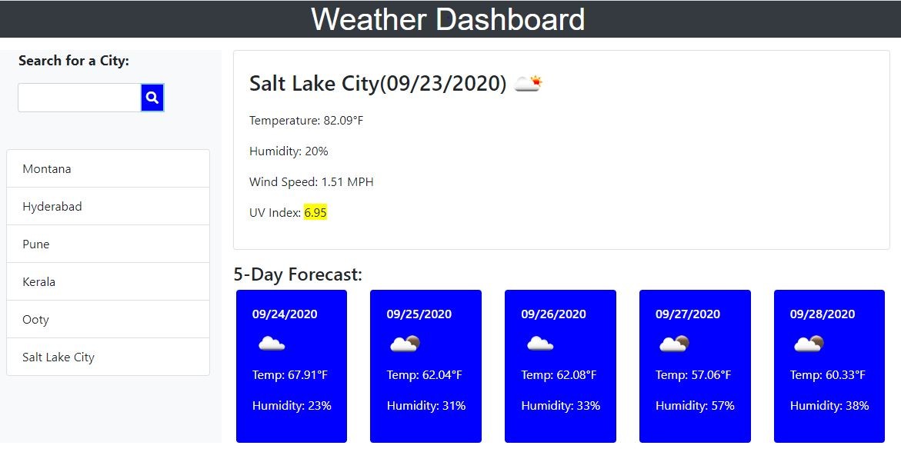

# Weather-Dashboard

## Description

This Application retrieves current and future conditions for selected cities using weather API

## Usage

* WHEN you search for a city
  THEN you are presented with current and future conditions for that city and that city is added to the search history
* WHEN you view current weather conditions for that city
  THEN you are presented with the city name, the date, an icon representation of weather conditions, the temperature, the humidity, the wind speed, and the UV index
* WHEN you view the UV index
  THEN you are presented with a color that indicates whether the conditions are favorable, moderate, or severe
* WHEN you view future weather conditions for that city
  THEN you are presented with a 5-day forecast that displays the date, an icon representation of weather conditions, the temperature, and the humidity
* WHEN you click on a city in the search history
  THEN you are again presented with current and future conditions for that city

## Sources Referred

* Usage of .filter():  https://api.jquery.com/filter/

  Reduce the set of matched elements to those that match the selector or pass the function's test.

## Deployed URL of the application

https://shravaniallamreddy.github.io/Weather-Dashboard/
